---
# Front matter
lang: ru-RU
title: 'Отчёт'
subtitle: 'по лабораторной работе 6'
author: 'Агеева Анастасия Борисовна'

# Formatting
toc-title: 'Содержание'
toc: true # Table of contents
toc_depth: 2
lof: true # List of figures
lot: true # List of tables
fontsize: 12pt
linestretch: 1.5
papersize: a4paper
documentclass: scrreprt
polyglossia-lang: russian
polyglossia-otherlangs: english
mainfont: PT Serif
romanfont: PT Serif
sansfont: PT Sans
monofont: PT Mono
mainfontoptions: Ligatures=TeX
romanfontoptions: Ligatures=TeX
sansfontoptions: Ligatures=TeX,Scale=MatchLowercase
monofontoptions: Scale=MatchLowercase
indent: true
pdf-engine: lualatex
header-includes:
  - \linepenalty=10 # the penalty added to the badness of each line within a paragraph (no associated penalty node) Increasing the value makes tex try to have fewer lines in the paragraph.
  - \interlinepenalty=0 # value of the penalty (node) added after each line of a paragraph.
  - \hyphenpenalty=50 # the penalty for line breaking at an automatically inserted hyphen
  - \exhyphenpenalty=50 # the penalty for line breaking at an explicit hyphen
  - \binoppenalty=700 # the penalty for breaking a line at a binary operator
  - \relpenalty=500 # the penalty for breaking a line at a relation
  - \clubpenalty=150 # extra penalty for breaking after first line of a paragraph
  - \widowpenalty=150 # extra penalty for breaking before last line of a paragraph
  - \displaywidowpenalty=50 # extra penalty for breaking before last line before a display math
  - \brokenpenalty=100 # extra penalty for page breaking after a hyphenated line
  - \predisplaypenalty=10000 # penalty for breaking before a display
  - \postdisplaypenalty=0 # penalty for breaking after a display
  - \floatingpenalty = 20000 # penalty for splitting an insertion (can only be split footnote in standard LaTeX)
  - \raggedbottom # or \flushbottom
  - \usepackage{float} # keep figures where there are in the text
  - \floatplacement{figure}{H} # keep figures where there are in the text
---

# Цель работы

Развить навыки администрирования ОС Linux. Получить первое прак- тическое знакомство с технологией SELinux1.
Проверить работу SELinx на практике совместно с веб-сервером Apache.

# Задание

Лабораторная работа подразумевает использование стандартного дистрибутива Linux CentOS с включённой политикой SELinux targeted и режимом enforcing

# Выполнение лабораторной работы

1. Установим/обновим веб-сервер Apache (рис.1).

   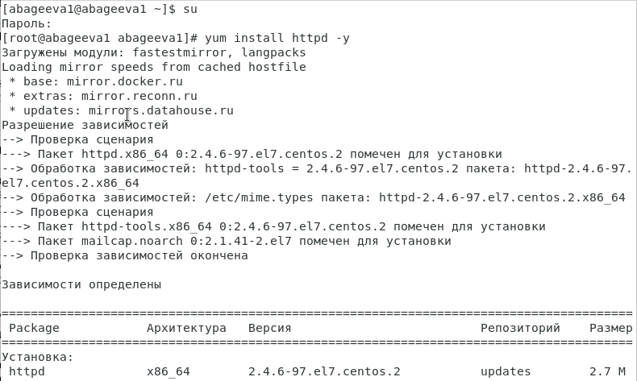{ #fig:001 width=60% }

2. В конфигурационном файле /etc/httpd/conf/httpd.conf зададим параметр ServerName (рис.2).

   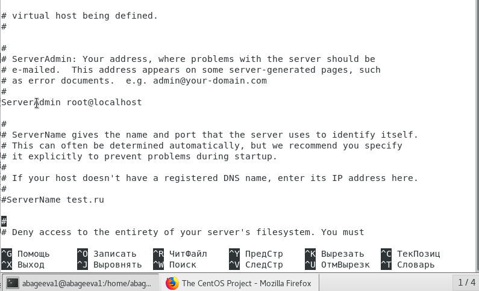{ #fig:002 width=60% }

3. Добавим разрещающие правила для подключения к 80-у и 81-у портам протокола TCP  (рис.3-6).

   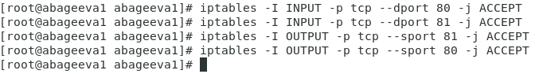{ #fig:003 width=60% }

4. Убедимся, что SELinux работает в режиме enforcing политики targeted с помощью команд getenforce и sestatus (Рис. 4)

5. Обратимся к веб-серверу, запущенному на нашем стенде, и убедимся, что он работает. (рис.4).

   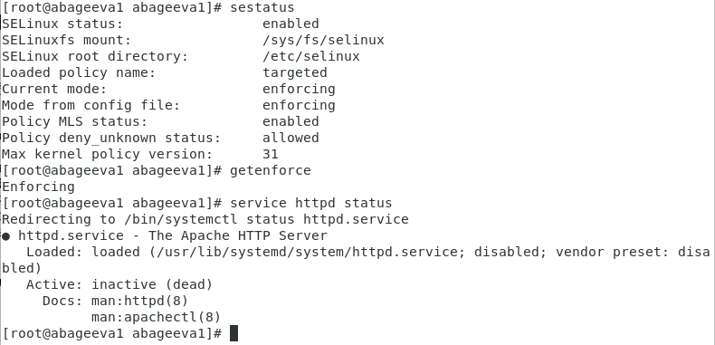{ #fig:004 width=60% }

6. Найдем Apache в списке процессов, определим его контекст безопасности. В нашем случае контекст безопасности unconfined_u:system_r:httpd_t (Рис. 5)

   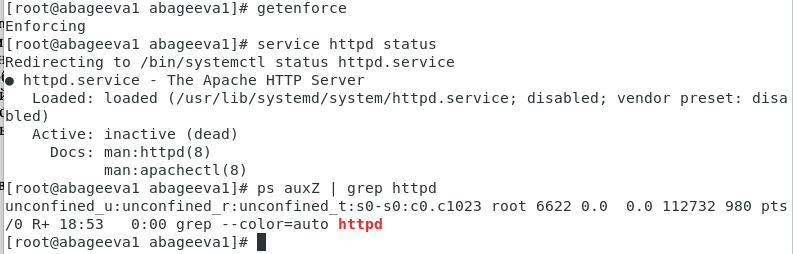{ #fig:005 width=60% }

7. Посмотрим текущее состояние переключателей SELinux для Apache. Многие из переключателей в положении “off” (рис.6-14).

   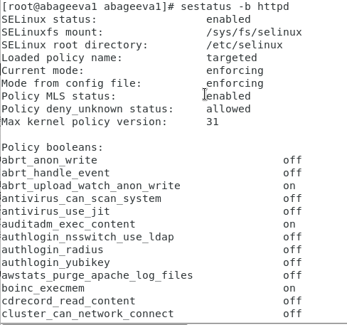{ #fig:006 width=60% }

   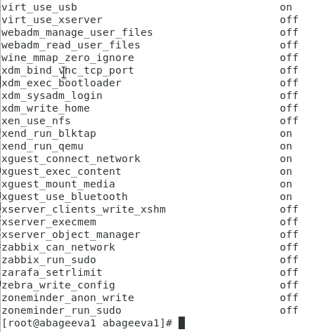{ #fig:007 width=60% }

   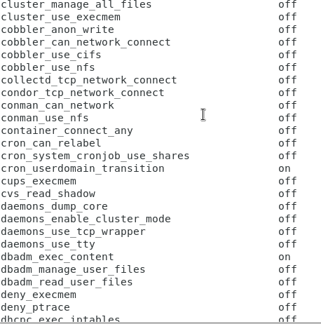{ #fig:008 width=60% }

   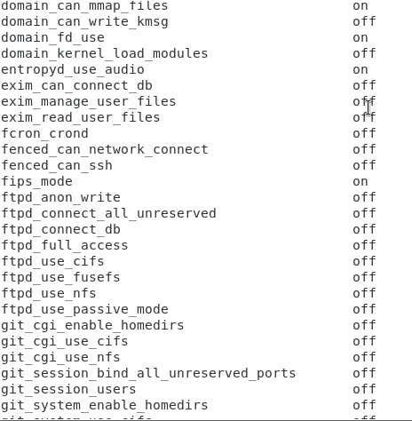{ #fig:009 width=60% }

   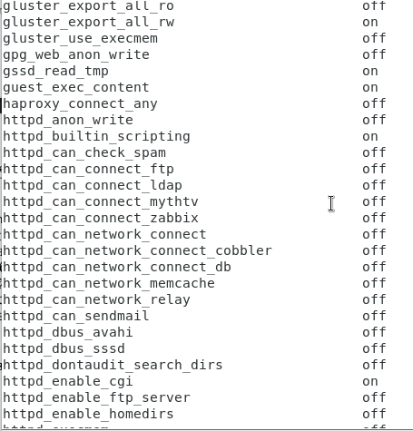{ #fig:010 width=60% }

   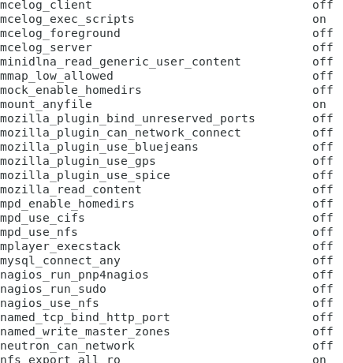{ #fig:011 width=60% }

   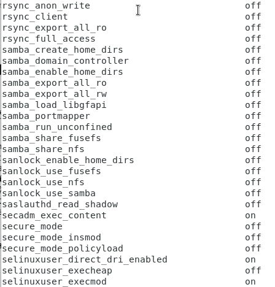{ #fig:012 width=60% }

   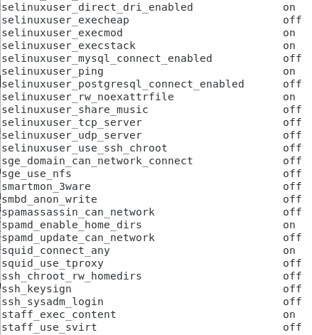{ #fig:013 width=60% }

   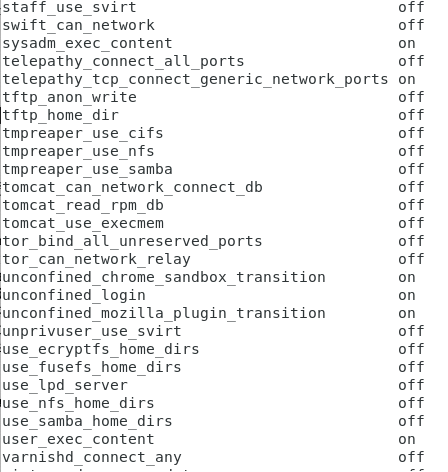{ #fig:014 width=60% }

8. Посмотрим статистику по политике с помощью команды seinfo, также определим множество пользователей, ролей и типов. Пользователей: 9 Ролей: 12 Типов: 3920 (рис.15).

9. Определим тип файлов и поддиректории, находящихся в директории /var/www (рис.15).

10. Определим тип файлов, находящихся в директории /var/www/html (рис.15).

   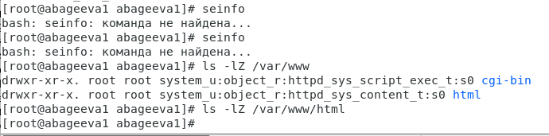{ #fig:015 width=60% }

11. Определим круг пользователей, которым разрешено создание файлов в директории /var/www/html (рис.17).

   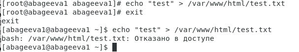{ #fig:017 width=60% }

12. По рисунку видно, что только root может создать файл в данной директории.

13. В следствие этого создадим от имени суперпользователя html-файл /var/www/html/test.html следующего содержания (рис.18).

   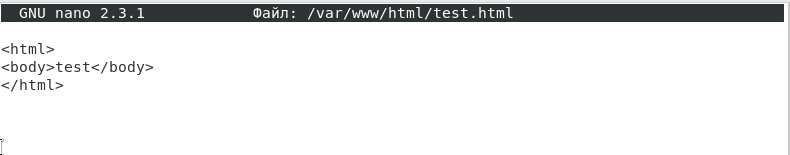{ #fig:018 width=60% }

14. Проверим контекст созданного файла. В нашем случае контекст unconfined_u:object_r:httpd_sys_content_t (рис.19).

   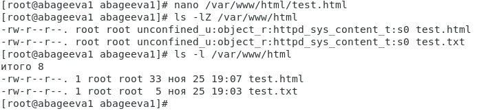{ #fig:019 width=60% }

15. Обратимся к файлу через веб-сервер, введя в firefox адрес http://127.0.0.1/test.html
Убедимся, что файл был успешно отображен 
 (рис.20).

   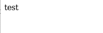{ #fig:020 width=60% }

16. Проверим контекст файла. Т.к. по умолчанию пользователи CentOS являются unconfined от типа, созданному нами файлу test.html был сопоставлен SELinux, пользователь unconfined_u. Это первая часть контекста. Далее политика ролевого разделения доступа RBAC используется процессами, но не файлами, поэтому роли не имеют никакого значения для файлов. Роль object_r используется по умолчанию для файлов на «постоянных» носителях и на сетевых файловых системах. Тип httpd_sys_content_t позволяет процессу httpd получить доступ к файлу. Благодаря наличию последнего типа мы получили доступ к файлу при обращении к нему через браузер. (рис.21).
   
17. Изменим контекст файла /var/www/html/test.html с httpd_sys_content_t на samba_shate_t. Как видно из рисунка, контекст успешно сменился. (рис.21).

   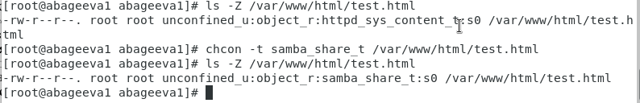{ #fig:021 width=60% }

18. Попробуем еще раз получить доступ к файлу через веб-сервер, введя в firefox адрес http://127.0.0.1/test.html. Как видно из рисунка, мы получили сообщение об ошибке. (рис.22).

   { #fig:022 width=60% }

19. Проанализируем ситуацию, просмотрев log-файлы веб-сервера Apache, системный log-файл и audit.log при условии уже запущенных процессов setroubleshootd и audtd. Исходя из log-файлов, мы можем заметить, что проблема в измененном контексте на шаге 17, т.к. процесс httpd не имеет доступа на samba_share_t. (рис.23-25).

   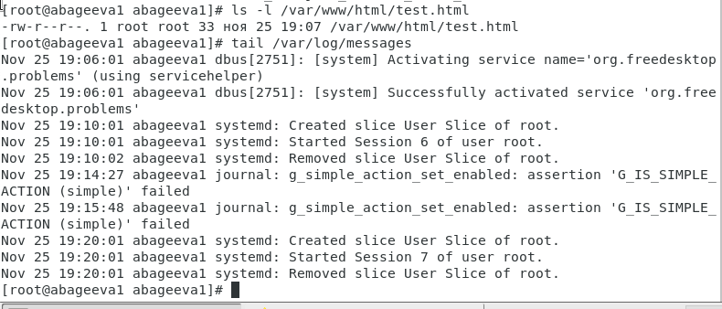{ #fig:023 width=60% }

   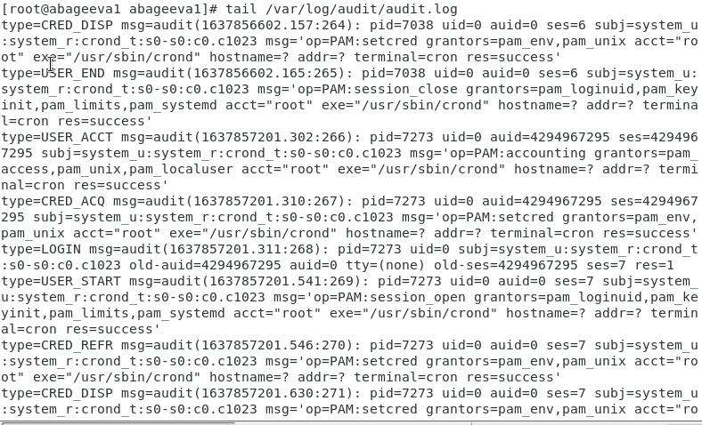{ #fig:024 width=60% }

   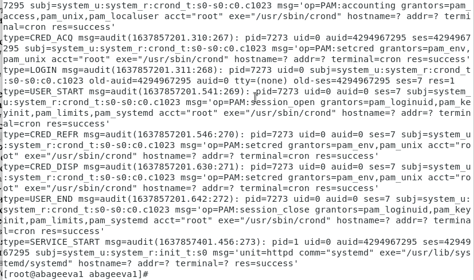{ #fig:025 width=60% }

20. Попробуем запустить Apache на прослушивание TCP-порта 81, заменив в файле /etc/httpd/conf/httpd.conf строчку Listen 80 на Listen 81. (рис.26).

   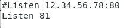{ #fig:026 width=60% }

21. Перезапустим Apache и попробуем обратиться к файлу через веб-сервер, введя в firefox адрес http://127.0.0.1/test.html. Из этого можно сделать предположение, что в списках портов, работающих с веб-сервером Apache, отсутствует порт 81. (рис.27-28).

   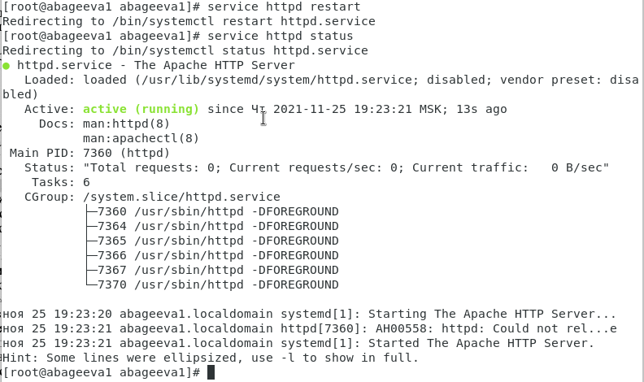{ #fig:027 width=60% }

   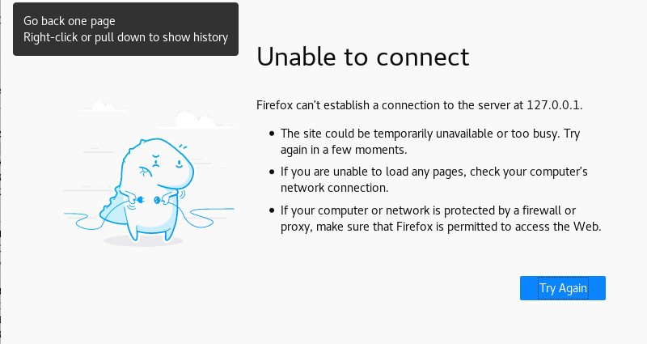{ #fig:028 width=60% }

22. Подтвердим свои догадки, просмотрев log-файлы. Во всех log-файлах появились записи, кроме /var/log/messages. (рис.29).

   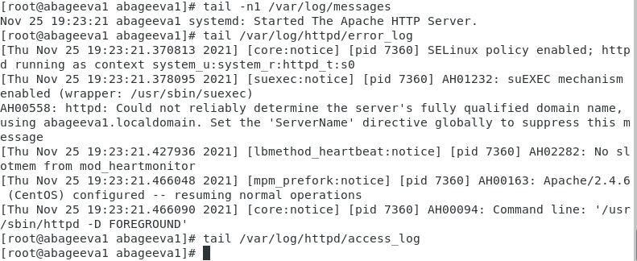{ #fig:029 width=60% }

23. Чтобы подключиться к веб-серверу через порт 81, добавим его с помощью команды
semanage port –a –t http_port_t –p tcp 81
После этого проверим список портов
semanage port –l | grep http_port_t. (рис.32).

   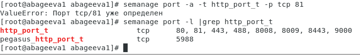{ #fig:032 width=60% }

24. Попробуем теперь запустить веб-сервер еще раз. Добавив порт 81 в систему, Apache cмог прослушать данный порт, в следствие чего получилось обратиться к файлу test.html. (рис.33-34).

   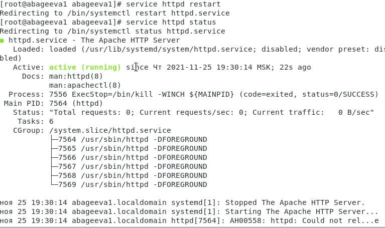{ #fig:033 width=60% }

   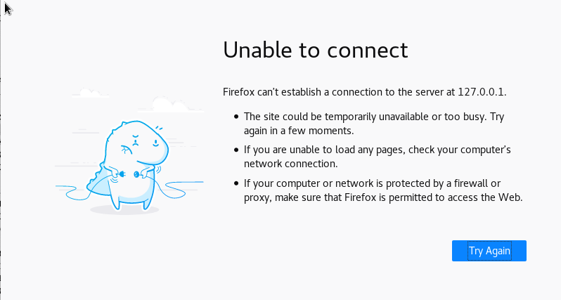{ #fig:034 width=60% }

25. Вернем обратно контекст httpd_sys_content_t к файлу /var/www/html/test.html. После этого вновь попробуем получить доступ к файлу через веб-сервер, введя в firefox адрес http://127.0.0.1:81/test.html. (рис.35-36).

   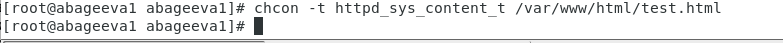{ #fig:035 width=60% }

   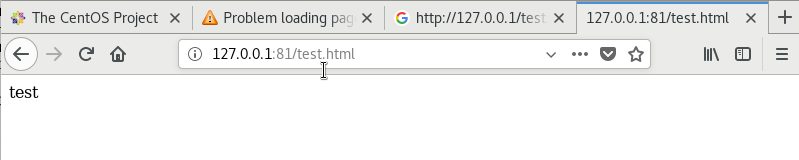{ #fig:036 width=60% }

26. Исправим обратно конфигурационный файл Apache, вернув Listen 80  (рис.37).

   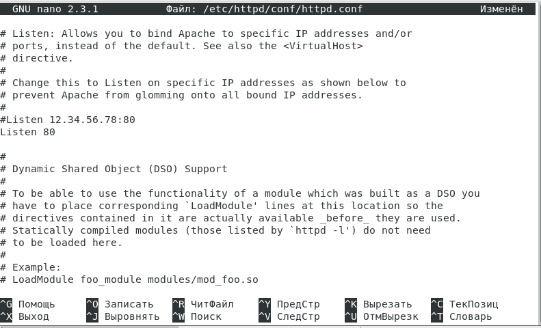{ #fig:037 width=60% }

27. Удалим привязку http_port_t к 81 порту  (рис.38).

28. Проверим, что порт 81 удален. (рис.38).

29. Удалим файл /var/www/html/test.html  (рис.38).

   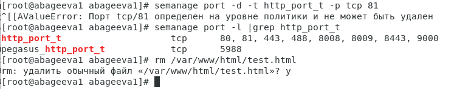{ #fig:038 width=60% }

# Выводы

Я развила навыки администрирования ОС Linux, получила первое практическое знакомство с технологией SELinux, а также проверила работу SELinx на практике совместно с веб-сервером Apache.
